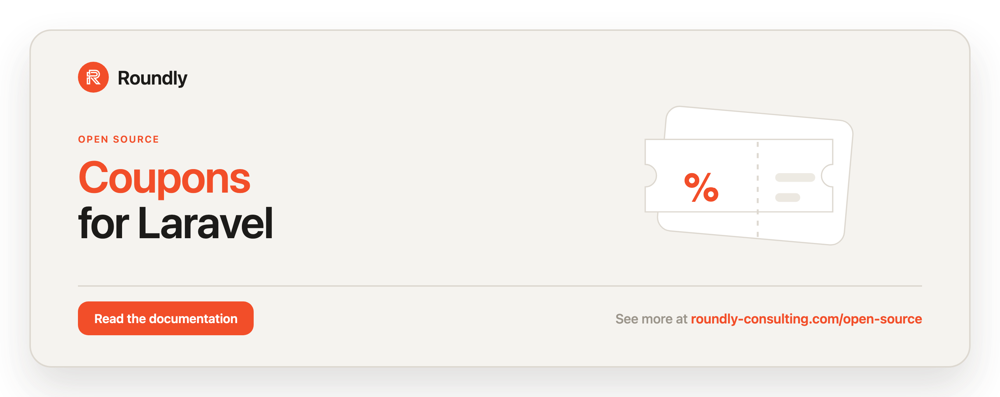

<!-- roundly-hero:start -->
<p align="center">
  <a href="https://roundly-consulting.com/open-source/docs/coupons-for-laravel?utm_source=github&utm_medium=readme&utm_campaign=open-source&utm_content=coupons-for-laravel">
    
  </a>
</p>
<!-- roundly-hero:end -->

<!-- roundly-badges:start -->
<p align="center">
  <a href="https://packagist.org/packages/roundly-consulting/coupons-for-laravel"></a>
  <a href="https://github.com/roundly-consulting/coupons-for-laravel/actions/workflows/run-tests.yml"></a>
  <a href="https://github.com/roundly-consulting/coupons-for-laravel/actions/workflows/fix-php-code-style-issues.yml"></a>
  <a href="https://donate.stripe.com/dRmeVe8FX5PF1Qd9pXcEw00"></a>
  <a href="https://www.patreon.com/cw/roundly"></a>
  <a href="https://roundly-consulting.com/support-us?utm_source=github&utm_medium=readme&utm_campaign=open-source&utm_content=coupons-for-laravel#crypto"></a>
</p>
<!-- roundly-badges:end -->

# Coupons for Laravel

Create, manage, redeem, and apply discount coupons in Laravel. Coupons support fixed-amount,
percentage (optionally capped), and free-shipping discounts, an optional currency lock and
minimum spend, activation and expiry windows, global and per-redeemer usage limits, a
validated **atomic** redemption flow, query scopes, route-model binding, console commands, a
fluent `Coupons` facade — with every amount a
[money-for-laravel](https://github.com/roundly-consulting/money-for-laravel) `Money`
(exponent-correct for JPY/BHD, arbitrary precision, no floats) and no third-party runtime
dependencies.

## Requirements

- PHP 8.4 with `ext-bcmath`
- Laravel 12 or 13

## Installation

```bash
composer require roundly-consulting/coupons-for-laravel
```

Publish and run the migrations. The package does **not** auto-load them — publishing copies
both migrations (`coupons`, then `coupon_redemptions`) into your `database/migrations`, where
you own them, so a bare `php artisan migrate` before publishing creates nothing:

```bash
php artisan vendor:publish --tag="coupons-migrations"
php artisan migrate
```

Optionally publish the config file:

```bash
php artisan vendor:publish --tag="coupons-config"
```

Optionally publish the translation strings (the validation-rule and discount-type messages)
to customise or translate them:

```bash
php artisan vendor:publish --tag="coupons-translations"
```

## Configuration

The published `config/coupons.php` exposes:

```php
return [
    'model' => \RoundlyConsulting\Coupons\Models\Coupon::class,
    'default_currency' => env('COUPONS_CURRENCY', 'USD'),
    'redeemer' => [
        'track' => env('COUPONS_TRACK_REDEEMERS', true),
    ],
    'code' => [
        'length' => env('COUPONS_CODE_LENGTH', 6),
        'charset' => env('COUPONS_CODE_CHARSET', 'ABCDEFGHIJKLMNOPQRSTUVWXYZ0123456789'),
    ],
    'route_key' => env('COUPONS_ROUTE_KEY', 'code'),
];
```

| Key | Type | Default | Env | Purpose |
|---|---|---|---|---|
| `model` | `class-string` | `RoundlyConsulting\Coupons\Models\Coupon` | — | Coupon model. Point it at your own subclass to extend behaviour; the manager, actions and both console commands all use it. |
| `default_currency` | `string` | `USD` | `COUPONS_CURRENCY` | ISO 4217 code the shipped `CouponFactory` locks fixed and capped coupons to when a state names none (also shown by `about`). Redemption never assumes a currency: it always takes the cart total's. |
| `redeemer.track` | `bool` | `true` | `COUPONS_TRACK_REDEEMERS` | Record a `coupon_redemptions` row per redeemer (powers per-redeemer caps). Env-style values work: `1`/`true`/`on`/`yes` and `0`/`false`/`off`/`no`; anything unparseable keeps tracking on. |
| `code.length` | `int` | `6` | `COUPONS_CODE_LENGTH` | Length of auto-generated codes, `4`–`64`. |
| `code.charset` | `string` | `A–Z0–9` | `COUPONS_CODE_CHARSET` | Alphabet for auto-generated codes: at least 2 distinct symbols (case-insensitively), no whitespace or control characters. It is upper-cased like every code. Multibyte symbols are fine. |
| `route_key` | `string` | `code` | `COUPONS_ROUTE_KEY` | Column used for route-model binding of `{coupon}`. Set to `id` to bind by primary key. |

The package ships sensible defaults and works with zero configuration.

Generated codes draw every symbol from a cryptographically secure source. The `code.*` keys
are validated whenever a code is generated: an out-of-range length or an unusable alphabet
throws `InvalidCouponConfiguration` (a `CouponException`) naming the key, never its value.
A generated code is checked against every existing coupon, soft-deleted ones included; if 10
candidates in a row are taken, the code space is too small and the same exception tells you
to widen it (or pass an explicit code). Explicit codes are never checked against the format.

Codes are **case-insensitive**. Every code is stored trimmed and upper-cased (`' summer '` is
stored as `SUMMER`), and every lookup — `find()`, `exists()`, `check()`, `preview()`,
`redeem()`, `expireAll()`, the validation rule, `whereCode()`, `hasRedeemed()` and `{coupon}`
route binding — normalises the code the same way, so matching and uniqueness never depend on
your database's collation.

### Money, units & the currency lock

Every amount is a `RoundlyConsulting\Money\Money` from money-for-laravel — minor units as an
exact integer string, in a registered currency with its real exponent (`500 JPY` is ¥500,
`1500 BHD` is 1.500 BD). A coupon's `value` means:

| Type | `value` | Example |
|---|---|---|
| `Fixed` | minor units of the coupon's `currency` | `500` + `EUR` = €5.00 off |
| `Percentage` | **basis points** (0..10 000) | `2500` = 25 %, `1250` = 12.5 % |
| `FreeShipping` | ignored (`0`) | — |

A coupon **must** be locked to a currency when it is `Fixed` or has a `minimum_spend` /
`max_discount` — both are `Money` in the coupon's `currency` (they share that column).
`CreateCouponAction` enforces it (`InvalidCouponDefinition`), and a `Fixed` row written around
the action without a currency is refused when it is used. Percentage and free-shipping coupons
without a minimum spend or cap may stay unlocked and apply to any currency.

## Usage

### The `Coupons` facade

`Coupons` is the entry point for everything the package does:

```php
use RoundlyConsulting\Coupons\Facades\Coupons;
use RoundlyConsulting\Coupons\Enums\DiscountType;
use RoundlyConsulting\Money\Money;

$coupon = Coupons::generate(DiscountType::Percentage, value: 2000, code: 'SUMMER', maxUsage: 100); // 20 %
$coupon = Coupons::generate(DiscountType::Fixed, value: 500, code: 'FIVE', currency: 'EUR');       // €5.00
$coupon = Coupons::create($data);         // from a CreateCouponData
$coupon = Coupons::createQuietly($data);  // without dispatching CouponCreated (seeders, fixtures)

// One coupon, by code or model:
Coupons::code('SUMMER')->check($cart, $user);   // ?RedemptionFailureReason — null = redeemable
Coupons::code('SUMMER')->preview($cart);        // Money — the discount, without redeeming
Coupons::code('SUMMER')->redeem($cart, $user);  // RedemptionResult
Coupons::code('SUMMER')->revoke();              // expire it now (reversible), fires CouponRevoked

// The same verbs, flat:
Coupons::check('SUMMER', $cart, $user);
Coupons::preview($coupon, $cart);
Coupons::redeem('SUMMER', $cart, redeemer: $user);
Coupons::revoke($coupon);                 // a Coupon or a code

// Lookups:
Coupons::find('SUMMER');                  // ?Coupon
Coupons::findOrFail('SUMMER');            // throws CouponNotFound
Coupons::exists('SUMMER');                // bool
Coupons::redeemable()->get();             // query builder of coupons redeemable right now

// Maintenance (the console commands call these):
Coupons::expireAll();                     // revoke every live coupon; returns the count
Coupons::expireAll(code: 'SUMMER');       // only the live coupon holding that code
Coupons::prune(days: 30);                 // soft-delete coupons expired 30+ days ago; returns the count
Coupons::prune(days: 30, force: true);    // delete them permanently, previously trashed ones included
```

`check()` answers "why won't this code work?" before checkout. It runs the same checks, in the
same order, as `redeem()` and returns the first failing `RedemptionFailureReason` (`NotFound`,
`CurrencyMismatch`, `MinimumSpendNotMet`, `Expired`, `AtMaxUsage`, `AlreadyRedeemed`), or `null`.
It never throws, locks or writes. The cart total and the redeemer are both optional: without a
total it skips the currency and minimum-spend checks, and without a redeemer it skips the
per-redeemer cap. `$reason->translationKey()` gives you the same translatable message the
validation rule shows.

```php
if ($reason = Coupons::code($request->code)->check($cart, $request->user())) {
    return back()->withErrors(['code' => __($reason->translationKey(), ['code' => $request->code])]);
}

$discount = Coupons::code($request->code)->preview($cart); // show it before the order is placed
```

`preview()` never throws on a currency mismatch; it returns zero. It does throw `CouponNotFound`
for an unknown code. `redeem()` and `revoke()` accept a code or a `Coupon`.

A new coupon starts **inactive** (`activated_at` is null), so redeeming it throws
`CouponExpired` until you activate it: `$coupon->activate()->save()` (or pass a future
`CarbonInterface` to schedule it).

`revoke()` is a reversible kill-switch. It sets `expires_at` to now (the row is **not**
deleted) and fires `CouponRevoked`. Re-activate later with `$coupon->expire($future)->save()`
or by clearing `expires_at`. `prune()` refuses a negative window with an
`InvalidArgumentException`, because a window in the future would delete live coupons.

### Without the facade

The facade is a thin layer over `CouponManager`. Inject the manager to get the same API without
the facade:

```php
use RoundlyConsulting\Coupons\CouponManager;
use RoundlyConsulting\Coupons\DataTransferObjects\RedemptionResult;
use RoundlyConsulting\Money\Money;

final class ApplyCoupon
{
    public function __construct(private CouponManager $coupons) {}

    public function __invoke(string $code, Money $cart, User $user): RedemptionResult
    {
        return $this->coupons->code($code)->redeem($cart, $user);
    }
}
```

Each operation is also a plain action class you can resolve and run yourself:

```php
use RoundlyConsulting\Coupons\Actions\{CheckCouponAction, CreateCouponAction, ExpireCouponsAction,
    PruneCouponsAction, RedeemCouponAction, RevokeCouponAction};
use RoundlyConsulting\Coupons\DataTransferObjects\RedeemCouponData;

app(CheckCouponAction::class)->execute('SUMMER', $cart, $user);   // ?RedemptionFailureReason
app(RedeemCouponAction::class)->execute(new RedeemCouponData(coupon: 'SUMMER', price: $cart, redeemer: $user));
app(RevokeCouponAction::class)->execute($coupon);
app(ExpireCouponsAction::class)->execute();                       // int
app(PruneCouponsAction::class)->execute(days: 30, force: false);  // int
```

The model (`$coupon->redeemBy()`, `$coupon->isRedeemableBy()`), the `HasCoupons` trait
(`$user->redeemCoupon()`), the validation rule and both console commands all go through the
manager, so the fake below sees every call.

### Testing with the fake

`Coupons::fake()` swaps the manager, for the facade and for every injected `CouponManager`, with
a recorder that writes nothing: no rows and no events. It records every mutation, including
redemptions made through `$coupon->redeemBy()` and `$user->redeemCoupon()`:

```php
use RoundlyConsulting\Coupons\Enums\RedemptionFailureReason;
use RoundlyConsulting\Coupons\Facades\Coupons;
use RoundlyConsulting\Money\Money;

$fake = Coupons::fake();

// ... run the code under test ...

$fake->assertCreated();                                             // or a callback: fn (Coupon $c) => …
$fake->assertNothingCreated();
$fake->assertRedeemed('SUMMER');                                    // by code
$fake->assertRedeemed('SUMMER', fn ($result) => /* ... */ true);    // by code + callback
$fake->assertRedeemed(callback: fn ($result) => /* ... */ true);    // by callback only
$fake->assertNotRedeemed('OTHER');
$fake->assertNothingRedeemed();
$fake->assertRedemptionFailed('OLD', RedemptionFailureReason::Expired); // reason optional; a string works too
$fake->assertRevoked('SUMMER');                                     // code optional
$fake->assertExpiredAll();
$fake->assertNothingRevoked();                                      // no revoke() and no expireAll()
$fake->assertPruned(days: 30, force: false);                        // both optional
$fake->assertNothingPruned();
```

Reads on the fake check the coupons created on it first, then the database. An unknown code
behaves like a fresh, unrestricted, zero-value coupon: `check()` returns `null` and `redeem()`
records a success, so a check-then-redeem flow works without seeding. Coupons created on the
fake count as active too. A **database row** gets the real checks: a seeded coupon nobody
activated is refused as `Expired`, exactly as in production. A successful faked redemption
returns the discount and total the real one would compute (a 20 % coupon on €50.00 gives
`discount` 10.00 and `total` 40.00); a refused one returns a zero discount and the full price,
is recorded as a failure, and never counts as redeemed. `redeem()` never throws on the fake.
`create()` and `generate()` refuse the same invalid definitions as the real ones
(`InvalidCouponDefinition`), but don't check that a code is taken. To test a refusal, seed a
coupon, either on the fake (`Coupons::generate(...)`) or as a row.

### Discount types

The `DiscountType` enum names how a coupon's value applies; the math is money-for-laravel's
`Discount`:

```php
use RoundlyConsulting\Coupons\Enums\DiscountType;
use RoundlyConsulting\Money\Currency;
use RoundlyConsulting\Money\Money;

$eur = Currency::of('EUR');

DiscountType::Fixed->toDiscount(250, $eur)->applyTo(Money::ofMinor(1000, 'EUR'));        // 7.50 EUR
DiscountType::Percentage->toDiscount(1250, $eur)->amountFor(Money::ofMinor(999, 'EUR'));  // 1.25 EUR (12.5 %, half away from zero)
DiscountType::Percentage->toDiscount(5000, $eur, cap: Money::ofMinor(300, 'EUR'));       // 50 % capped at 3.00 EUR

// Free shipping is a discount on the SHIPPING target — route by $discount->target(); never
// apply it to the price of the goods.
DiscountType::FreeShipping->toDiscount(0, $eur)->target(); // DiscountTarget::Shipping

// Translatable labels and descriptions for admin UIs:
DiscountType::Percentage->label();         // "Percentage"
DiscountType::Percentage->description();   // "Subtracts a percentage of the price."
DiscountType::FreeShipping->requiresValue(); // false (Fixed/Percentage are true)
```

### Creating coupons

Use the facade (`Coupons::create($data)`), or `CreateCouponAction` with a `CreateCouponData` DTO. A unique code is
generated when you don't supply one, and a `CouponCreated` event is dispatched.

```php
use RoundlyConsulting\Coupons\Actions\CreateCouponAction;
use RoundlyConsulting\Coupons\DataTransferObjects\CreateCouponData;
use RoundlyConsulting\Coupons\Enums\DiscountType;
use RoundlyConsulting\Money\Currency;
use RoundlyConsulting\Money\Money;

$create = app(CreateCouponAction::class);

// Named constructors pick the unit and the currency lock for you:
$create->execute(CreateCouponData::fixed(Money::ofMinor(500, 'EUR'), code: 'FIVE'));             // €5.00, locked to EUR
$create->execute(CreateCouponData::percentage('12.5', code: 'EIGHTH',
    maxDiscount: Money::ofMinor(1500, 'EUR')));                                                   // 12.5 %, capped, locked to EUR
$create->execute(CreateCouponData::freeShipping(code: 'SHIP', minimumSpend: Money::ofMinor(3000, 'EUR')));

// Or the full DTO:
$create->execute(new CreateCouponData(
    type: DiscountType::Percentage,
    value: 2000,                         // basis points: 20 % off
    currency: Currency::of('EUR'),       // optional lock (required for Fixed / min spend / cap)
    code: 'SAVE20',                      // optional — auto-generated when omitted
    maxUsage: 100,                       // optional — 0 means unlimited
    minimumSpend: Money::ofMinor(5000, 'EUR'),
    maxDiscount: Money::ofMinor(1000, 'EUR'),
));
```

`CreateCouponAction` throws `InvalidCouponDefinition` for a blank explicit code (`''` or only
whitespace), a `Fixed` coupon without a currency, a negative fixed value, or a percentage
outside 0..10 000 basis points; a minimum spend or cap
in another currency than the lock throws money's `CurrencyMismatch`.

A code is unique among coupons that are **not soft-deleted**. An explicit code a live coupon
already holds (in any case) throws `CouponCodeTaken`, a `CouponException` — also when a
concurrent request takes it between the check and the insert. A code that only soft-deleted
coupons hold is free: after `Coupons::prune()` trashes last season's `XMAS`, the next
`generate(code: 'XMAS')` creates a fresh coupon, and the old row keeps its code and redemption
history. Restoring a trashed coupon whose code a live coupon now holds fails with the
database's unique-constraint error. The uniqueness is enforced by the database (a unique index
on a generated column that holds the code only while the row is not trashed), which needs
MySQL/MariaDB, PostgreSQL or SQLite. `CreateCouponData::fixed()`
throws money's `AmountOverflow` for an amount beyond int64 minor units (`value` is a `bigint`).

### Redeeming a coupon

Redemption validates eligibility, increments usage **atomically** (a transaction with
`lockForUpdate` on the coupon model's own connection, so concurrent redemptions can never
exceed `max_usage` — also when `coupons.model` lives on a non-default connection), records a
per-redeemer row when tracking is on, and dispatches `CouponRedeemed`. It returns a
`RedemptionResult { Coupon $coupon, Money $discount, Money $total, ?Model $redeemer, bool $freeShipping }`.

```php
use RoundlyConsulting\Coupons\Facades\Coupons;
use RoundlyConsulting\Money\Money;

$result = Coupons::code('SAVE20')->redeem(Money::ofMinor(5000, 'EUR'), $user);

$result->discount;      // Money saved off the price — never more than the price
$result->total;         // new total after the discount
$result->freeShipping;  // true for a free-shipping coupon — zero your own shipping line

// The same redemption from the model (redeemer may be null for guest checkout):
$result = $coupon->redeemBy($user, Money::ofMinor(5000, 'EUR'));
```

On failure it throws a precise, catchable exception — all extend `CouponNotRedeemable`
(except `CouponNotFound`), which extends `CouponException`:

```php
use RoundlyConsulting\Coupons\Exceptions\{CouponNotFound, CouponExpired, CouponAtMaxUsage,
    CouponAlreadyRedeemed, MinimumSpendNotMet, CurrencyMismatch};

try {
    $result = Coupons::redeem($code, $price, redeemer: $user);
} catch (CouponNotFound) {          // unknown code
} catch (CouponExpired) {           // not active / past expiry
} catch (CouponAtMaxUsage) {        // global cap reached
} catch (CouponAlreadyRedeemed) {   // per-redeemer cap reached
} catch (MinimumSpendNotMet) {      // price below the coupon's minimum
} catch (CurrencyMismatch) {        // coupon locked to another currency
}
```

### Currency lock, minimum spend & per-redeemer caps

```php
$coupon->currency;                 // ?Currency — null = any currency, or the lock
$coupon->minimum_spend;            // ?Money   — null = no minimum
$coupon->max_discount;             // ?Money   — null = uncapped
$coupon->max_usage_per_redeemer;   // 0 = unlimited per redeemer

$coupon->discountFor($price);           // Money — 0 ≤ discount ≤ price, capped; throws money's
                                        //         CurrencyMismatch on a locked mismatch
$coupon->apply($price);                 // Money — the price minus the discount (never negative)
$coupon->discount($currency);           // money Discount labelled with the code, for a DiscountStack

$coupon->appliesToCurrency($price);     // bool
$coupon->meetsMinimumSpend($price);     // bool
$coupon->usageBy($user);                // int
$coupon->isAtMaximumUsageFor($user);    // bool — "one per customer" when cap is 1
```

### Display helpers (non-throwing)

For views and APIs, read coupon state without manual math or try/catch. Each is safe to call
anywhere:

```php
$coupon->remainingUsage();            // ?int  — null when unlimited (max_usage <= 0)
$coupon->remainingUsageFor($user);    // ?int  — null when untracked or per-redeemer unlimited
$coupon->usagePercentage();           // ?float (0..100) — null when unlimited
$coupon->isRedeemableBy($user, $cart); // bool — no exceptions; pass a price to also check
                                       //        currency + minimum spend (both optional)
$coupon->previewDiscount($cart);      // Money — never throws; zero on a currency mismatch
```

`isRedeemableBy()`, `Coupons::check()` and the validation rule below all run the **same**
eligibility checks as `redeem()`, so they never drift out of sync — a soft-deleted `Coupon`
instance, for one, is `NotFound` for all of them, just as `redeem()` throws `CouponNotFound`. Use `Coupons::check()` when
you need the reason, not just a yes or no.

### Redeemer trait

Add `HasCoupons` to your redeemer model (typically `User`) for a first-class redeemer API:

```php
use RoundlyConsulting\Coupons\Concerns\HasCoupons;

class User extends Authenticatable
{
    use HasCoupons;
}
```

```php
$result  = $user->redeemCoupon('SAVE20', Money::ofMinor(5000, 'EUR')); // RedemptionResult
$history = $user->couponRedemptions;                              // morphMany history
$used    = $user->hasRedeemed('SAVE20');                          // bool (tracked only)
```

`redeemCoupon()` requires the cart total, in the cart's own currency: the discount comes off
it, the currency lock and minimum spend are checked against it, and a redemption without a
price would consume a use (the customer's only one, on a single-use coupon) at a zero discount.
`hasRedeemed()` asks about the live coupon holding the code and reflects only tracked
redemptions (`coupons.redeemer.track = true`, the default).

### Validation rule

`Rules\Redeemable` validates a coupon-code form field and reports a precise, translatable
message for the first failing reason — no need to catch six exceptions:

```php
use RoundlyConsulting\Coupons\Rules\Redeemable;

$request->validate([
    'code' => ['required', new Redeemable(cartTotal: $cart, redeemer: $request->user())],
]);
```

Both `cartTotal` and `redeemer` are optional: omit the cart total to skip currency and
minimum-spend checks, omit the redeemer to skip per-redeemer caps. Messages live in
`resources/lang/en/messages.php` and are publishable via the `coupons-translations` tag.

### Query scopes & route-model binding

```php
use RoundlyConsulting\Coupons\Models\Coupon;

Coupon::query()->active()->get();
Coupon::query()->expired()->get();
Coupon::query()->exhausted()->get();
Coupon::query()->redeemable()->get();    // active AND not expired AND not at max usage
Coupon::query()->whereCode('SAVE20')->first();
```

`{coupon}` route parameters bind by `code` by default (set `coupons.route_key` to `id` to
bind by primary key).

### Console commands

```bash
# Immediately expire coupons (admin kill-switch) — Coupons::expireAll(). --code limits it to
# one coupon. Each one is revoked like Coupons::revoke(): CouponRevoked fires per coupon.
php artisan coupons:expire
php artisan coupons:expire --code=SAVE20

# Prune coupons expired more than N days ago — Coupons::prune(). Soft deletes (the code is free
# to issue again, the history stays); --force deletes permanently, including coupons an earlier
# prune soft-deleted. A negative --days is refused.
php artisan coupons:prune --days=30
php artisan coupons:prune --days=30 --force
```

### Working with a coupon

```php
use RoundlyConsulting\Coupons\Models\Coupon;
use RoundlyConsulting\Money\Money;

$coupon = Coupon::query()->where('code', 'SAVE20')->firstOrFail();

$coupon->activate();          // activated_at = now (pass a CarbonInterface to schedule)
$coupon->expire($expiresAt);  // expires_at
$coupon->setMaxUsageTo(50);
$coupon->save();

$coupon->isActive();             // bool
$coupon->isExpired();            // bool
$coupon->isAtMaximumUsage();     // bool (a 0 cap is unlimited)
$coupon->hasBeenUsedAtLeastOnce();
$coupon->canBeApplied();         // active, not expired, not at max usage

// Apply the coupon to a price.
$discounted = $coupon->apply(Money::ofMinor(5000, 'EUR')); // €40.00 for 20% off
```

### Listening for events

A free-shipping coupon's `discountFor()` is zero and `apply()` returns the price unchanged:
free shipping is a flag (`$result->freeShipping`) the host applies to its own shipping line.

The package dispatches these events the host app can listen to:

| Event | When | Payload |
|---|---|---|
| `CouponCreated` | a coupon is created (not via `createQuietly`) | `Coupon $coupon` |
| `CouponRedeemed` | a redemption succeeds | `Coupon $coupon`, `RedemptionResult $result` |
| `CouponRedemptionFailed` | a redemption attempt is rejected | `string $code`, `RedemptionFailureReason $reason`, `?Model $redeemer` |
| `CouponExhausted` | a redemption consumes the final available use (fires **once**) | `Coupon $coupon` |
| `CouponRevoked` | a coupon is revoked via `Coupons::revoke()`, `Coupons::expireAll()` or `coupons:expire` (once per coupon) | `Coupon $coupon` |

```php
use Illuminate\Support\Facades\Event;
use RoundlyConsulting\Coupons\Events\CouponCreated;
use RoundlyConsulting\Coupons\Events\CouponRedeemed;
use RoundlyConsulting\Coupons\Events\CouponRedemptionFailed;
use RoundlyConsulting\Coupons\Events\CouponExhausted;

Event::listen(function (CouponRedeemed $event): void {
    logger()->info('Coupon redeemed', [
        'code' => $event->coupon->code,
        'discount' => (string) $event->result->discount, // "12.50 EUR"
    ]);
});

Event::listen(function (CouponRedemptionFailed $event): void {
    logger()->warning('Coupon rejected', [
        'code' => $event->code,
        'reason' => $event->reason->value, // e.g. "expired", "at_max_usage"
    ]);
});

Event::listen(function (CouponExhausted $event): void {
    logger()->info('Coupon exhausted', ['code' => $event->coupon->code]);
});
```

`CouponRedemptionFailed` fires from the redemption attempt (the single mutating path), once
per rejected attempt, and the matching exception is still thrown. `CouponExhausted` fires
exactly once — on the redemption that brings `usage` up to `max_usage` — never for unlimited
coupons and never again on a later rejected attempt.

### Per-redeemer tracking migration

Publish the migrations (`vendor:publish --tag="coupons-migrations"`) and run `php artisan
migrate` to add the `coupon_redemptions` table that powers per-redeemer caps. The redeemer is
a nullable morph, so guest (redeemer-less) redemptions are supported; per-redeemer caps apply
only when a redeemer is supplied.

## Integrates with

This package hard-requires two lower-tier roundly packages (wired automatically):

- **[money-for-laravel](https://github.com/roundly-consulting/money-for-laravel)** — every
  amount is its `Money`; a coupon's value becomes its `Discount` (fixed, percentage with
  fractional basis points, free shipping, cap); `minimum_spend` / `max_discount` /
  `amount_discounted` use its `AsMoney` casts and `$table->money()` columns (`decimal(38,0)`);
  `Coupon::discount()` hands hosts a `Discount` to compose in a `DiscountStack`.

- **[package-toolkit-for-laravel](https://github.com/roundly-consulting/package-toolkit-for-laravel)**
  — the service-provider builder (config, migrations, translations, commands and publish tags)
  and the validated `coupons.model` resolver, which checks that a swapped-in model really is a
  coupon model before the package queries through it.

The package reports its configuration to Laravel's `about` command. The generated-code alphabet
is reported by size only — printing it would hand a brute-forcer the exact key space coupon codes
are drawn from:

```bash
php artisan about --only=coupons
```

## Testing

```bash
composer test
```

## Changelog

See [CHANGELOG.md](CHANGELOG.md) for what has changed recently.

## Contributing

Contributions are welcome. Please open an issue or pull request on the repository.

<!-- roundly-support:start -->
## Support our work

This package is free and open source, built and maintained by
[Roundly Consulting](https://roundly-consulting.com/open-source?utm_source=github&utm_medium=readme&utm_campaign=open-source&utm_content=coupons-for-laravel).
If it saves you time, please consider supporting our open-source work — a one-time donation, a
monthly pledge on Patreon or a crypto donation helps fund maintenance, new features and new
packages.

<a href="https://donate.stripe.com/dRmeVe8FX5PF1Qd9pXcEw00"></a>
<a href="https://www.patreon.com/cw/roundly"></a>
<a href="https://roundly-consulting.com/support-us?utm_source=github&utm_medium=readme&utm_campaign=open-source&utm_content=coupons-for-laravel#crypto"></a>
<!-- roundly-support:end -->

## License

The MIT License (MIT). See [LICENSE.md](LICENSE.md) for details.
